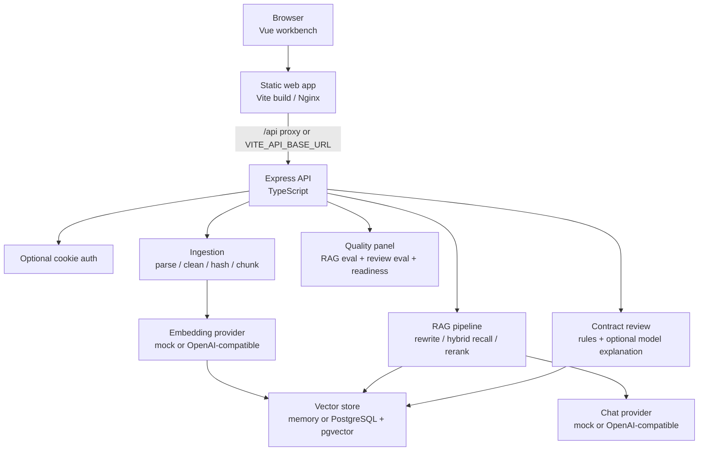

# Legal RAG

法律文档问答与合同风险审查工作台。项目提供从文档导入、公开安全数据集初始化、chunk/embedding、混合检索、引用溯源问答、合同审查到质量评测面板的一套完整 RAG 工程示例。


## Contents

- [Preview](#preview)
- [What It Does](#what-it-does)
- [Features](#features)
- [Architecture](#architecture)
- [Quick Start](#quick-start)
- [Configuration](#configuration)
- [Docker Compose](#docker-compose)
- [Deployment](#deployment)
- [Project Structure](#project-structure)
- [API](#api)
- [Testing](#testing)
- [Roadmap](#roadmap)
- [Security](#security)
- [License](#license)

## Preview

The current workbench is organized around four visitor-visible surfaces. Open the app locally or in a deployed demo to review the latest UI; screenshots under `docs/assets/screenshots/` are review artifacts and should be regenerated before being embedded in the GitHub README.

| Surface | Purpose |
| --- | --- |
| Knowledge Base | Import text/files, seed the public-safe dataset, view documents and chunks. |
| Q&A | Ask legal or contract questions and inspect citations plus retrieval diagnostics. |
| Contract Review | Submit text or a document and get structured risk findings. |
| Quality Panel | Inspect runtime mode, pgvector readiness, RAG eval, review eval, and recent quality trends. |

## What It Does

Legal RAG is useful when you want a small but complete legal-document RAG system that can run locally without secrets and can also be deployed with PostgreSQL + pgvector and OpenAI-compatible model gateways.

It is intentionally evidence-first:

- answers are grounded in retrieved chunks or refused when evidence is insufficient;
- citations preserve source title, section, and chunk index;
- contract review uses deterministic rules as the recall layer, then optionally lets a model improve wording after schema validation;
- quality endpoints expose RAG and contract-review evaluation results for the UI.

## Features

- Monorepo with `apps/web`, `apps/api`, and `packages/shared`.
- Vue 3 + Vite workbench with knowledge base, Q&A, review, and quality views.
- Express API with health, auth, project spaces, ingestion jobs, documents, RAG query, contract review, audit logs, and evaluation reports.
- Local mock mode: deterministic embeddings and in-memory vector store, no model key required.
- Production-capable mode: OpenAI-compatible chat/embedding providers plus PostgreSQL + pgvector.
- Project spaces for scoping documents, duplicate detection, retrieval, Q&A, contract review, and audit logs.
- Text, TXT, PDF, and DOCX import paths.
- Public-safe seed dataset in `datasets/public-safe/legal-public-dataset.jsonl`.
- SHA-256 document dedupe scoped to project space.
- Section-aware chunking, query rewrite, hybrid recall, filtering, and lightweight rerank.
- Contract review risk rules for payment, acceptance, liability, IP, and venue issues.
- RAG evaluation fixtures and contract-review risk recall fixtures.
- Docker Compose production demo with Nginx web container, API container, and pgvector PostgreSQL.
- GitHub Actions CI for typecheck, unit tests, validation, evaluation, build, and Compose config.

## Architecture



More details:

- [docs/architecture.md](docs/architecture.md)
- [docs/project-guide.zh-CN.md](docs/project-guide.zh-CN.md)
- [CONTEXT.md](CONTEXT.md)

## Quick Start

Requirements:

- Node.js 24
- npm

Install dependencies:

```powershell
npm.cmd install
```

Run API and web together:

```powershell
npm.cmd run dev
```

Local URLs:

- Web: `http://127.0.0.1:5173`
- API health: `http://127.0.0.1:4000/api/health`

Run one side only:

```powershell
npm.cmd run dev:api
npm.cmd run dev:web
```

The default local mode uses `MODEL_PROVIDER=mock` and `VECTOR_STORE=memory`, so it can run without a database or model key.

## Configuration

API env file:

```powershell
Copy-Item apps/api/.env.example apps/api/.env
```

Web env file:

```powershell
Copy-Item apps/web/.env.example apps/web/.env
```

Important API variables:

| Variable | Default | Purpose |
| --- | --- | --- |
| `PORT` | `4000` | API port. |
| `WEB_ORIGIN` | `http://localhost:5173` | Allowed browser origin for CORS and cookies. |
| `MODEL_PROVIDER` | `mock` | `mock` or `openai-compatible`. |
| `VECTOR_STORE` | `memory` | `memory` or `pgvector`. |
| `LLM_BASE_URL` / `LLM_API_KEY` / `LLM_MODEL` | empty / empty / model placeholder | Server-only chat model gateway configuration. |
| `EMBEDDING_BASE_URL` / `EMBEDDING_API_KEY` / `EMBEDDING_MODEL` / `EMBEDDING_DIM` | optional | Server-only embedding gateway configuration. Empty embedding URL/key reuses `LLM_*`. |
| `DATABASE_URL` | empty | PostgreSQL connection string, required when `VECTOR_STORE=pgvector`. |
| `AUTH_ENABLED` | `false` | Enables the login gate. |
| `AUTH_USERS_JSON` | empty | Optional multi-user demo config. |
| `AUTH_SESSION_SECRET` | empty | Required when auth is enabled. |
| `AUTH_COOKIE_SECURE` / `AUTH_COOKIE_SAME_SITE` | `false` / `Lax` | Cookie settings for local vs cross-site HTTPS deployment. |

Important Web variables:

| Variable | Default | Purpose |
| --- | --- | --- |
| `VITE_API_BASE_URL` | empty | Browser-facing API origin. Empty means same-origin `/api` or Vite proxy. |
| `VITE_PUBLIC_DEMO_EMAIL` | demo placeholder | Optional public login hint. |
| `VITE_PUBLIC_DEMO_PASSWORD` | empty | Optional public low-privilege demo password. This is bundled into frontend assets. |
| `VITE_PUBLIC_DEMO_NOTE` | empty | Optional public note shown with demo credentials. |

Never put real admin credentials, model keys, database URLs, Render/Supabase config, or private endpoints into `VITE_*` variables.

## Docker Compose

The production Compose file runs:

- PostgreSQL with pgvector;
- API container;
- Nginx static web container with `/api` proxy.

Create a local root `.env` from the example:

```powershell
Copy-Item .env.docker.example .env
```

Start:

```powershell
docker compose -f docker-compose.prod.yml up --build
```

Open:

- Web: `http://localhost:8080`
- API health: `http://localhost:8080/api/health`

The default Compose path uses `MODEL_PROVIDER=mock` and `VECTOR_STORE=pgvector`. To use a real OpenAI-compatible provider, fill server-only model and embedding variables in the root `.env`.

If you change embedding dimensions, use a new database or reset the Compose volume:

```powershell
docker compose -f docker-compose.prod.yml down -v
```

## Deployment

Recommended public deployment shape:

- Web: static host such as Render Static Site, Cloudflare Pages, Vercel, or Netlify.
- API: Docker-based Node Web Service.
- Database: PostgreSQL with pgvector.
- Model providers: server-side OpenAI-compatible chat and embedding gateways.

Render + Supabase guide:

- [docs/deploy-render-supabase.md](docs/deploy-render-supabase.md)

Minimal static web settings:

```text
Build Command: npm ci && npm run build:shared && npm --workspace apps/web run build
Publish Directory: apps/web/dist
```

Minimal API settings:

```text
Runtime: Docker
Dockerfile Path: apps/api/Dockerfile
Health Check Path: /api/health
```

Production auth checklist:

- set `AUTH_ENABLED=true`;
- set a strong `AUTH_SESSION_SECRET`;
- use `AUTH_USERS_JSON` for multiple revocable demo users;
- set `AUTH_COOKIE_SECURE=true` over HTTPS;
- set `AUTH_COOKIE_SAME_SITE=None` when Web and API are on different sites;
- set `WEB_ORIGIN` to the exact web origin, without a path or trailing slash.

## Project Structure

```text
apps/
  api/        Express API, RAG pipeline, contract review, eval, Dockerfile
  web/        Vue workbench, Vite config, Nginx config, smoke script
packages/
  shared/     Shared TypeScript API/domain types
datasets/     Public-safe legal dataset
eval/         RAG and contract-review evaluation fixtures
samples/      Sample contract text
docs/         Architecture, deployment, demo, and ADR notes
```

## API

Selected endpoints:

| Endpoint | Purpose |
| --- | --- |
| `GET /api/health` | Runtime health, model/vector configuration, corpus counts. |
| `GET /api/auth/status` | Login-gate status and current user. |
| `GET /api/projects` / `POST /api/projects` | Project-space listing and creation. |
| `POST /api/ingestion-jobs/import-text` | Async text ingestion. |
| `POST /api/ingestion-jobs/upload` | Async TXT/PDF/DOCX upload. |
| `POST /api/ingestion-jobs/seed` | Seed public-safe dataset. |
| `GET /api/documents` | List project documents. |
| `POST /api/rag/query` | Ask a citation-grounded RAG question. |
| `POST /api/contracts/review` | Review contract text or document. |
| `GET /api/quality/report` | Runtime readiness and evaluation summary. |
| `GET /api/evaluation/report` | Detailed RAG evaluation report. |
| `GET /api/review/evaluation/report` | Detailed contract-review evaluation report. |
| `GET /api/audit-logs` | Recent project-scoped audit entries. |

## Testing

Local deterministic checks:

```powershell
npm.cmd run typecheck
npm.cmd --workspace apps/api run test:unit
npm.cmd --workspace apps/api run validate
npm.cmd --workspace apps/api run evaluate
npm.cmd --workspace apps/api run evaluate:review
npm.cmd run build
docker compose -f docker-compose.prod.yml config
```

Optional pgvector/live embedding check:

```powershell
npm.cmd --workspace apps/api run validate:pgvector
```

`validate:pgvector` reads local environment variables and should be run only when a safe PostgreSQL + embedding configuration is available.

Web smoke:

```powershell
npm.cmd --workspace apps/web run test:e2e:smoke
```

CI currently runs typecheck, API unit tests, API validation, RAG evaluation, contract-review evaluation, build, and Docker Compose config.

## Roadmap

- Replace configured auth with a persisted user table, invitation flow, and richer RBAC.
- Add durable background ingestion with BullMQ or another queue.
- Expand public-safe legal and contract datasets.
- Add OCR and table-aware parsing for scanned or complex contracts.
- Introduce a dedicated rerank model or cross-encoder.
- Publish longer-term quality trends and release comparison reports.
- Package deployment templates once repository visibility, secrets policy, and license are finalized.

## Security

- Do not commit `.env`, real model keys, database URLs, passwords, cookies, or provider endpoints.
- `VITE_*` variables are public because they are bundled into the browser app.
- Public demo credentials, if configured, must be low-privilege, revocable, and safe to show on the login page.
- Contract review is an engineering workflow demonstration, not legal advice.
- RAG answers should be treated as evidence-grounded assistance; final legal conclusions need human review.

## License

No license file is currently included. Choose and add a license before presenting the repository as reusable open-source software.
