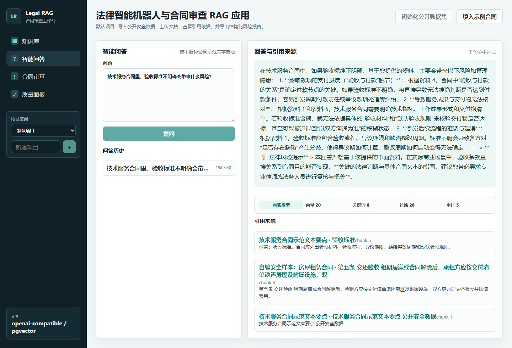
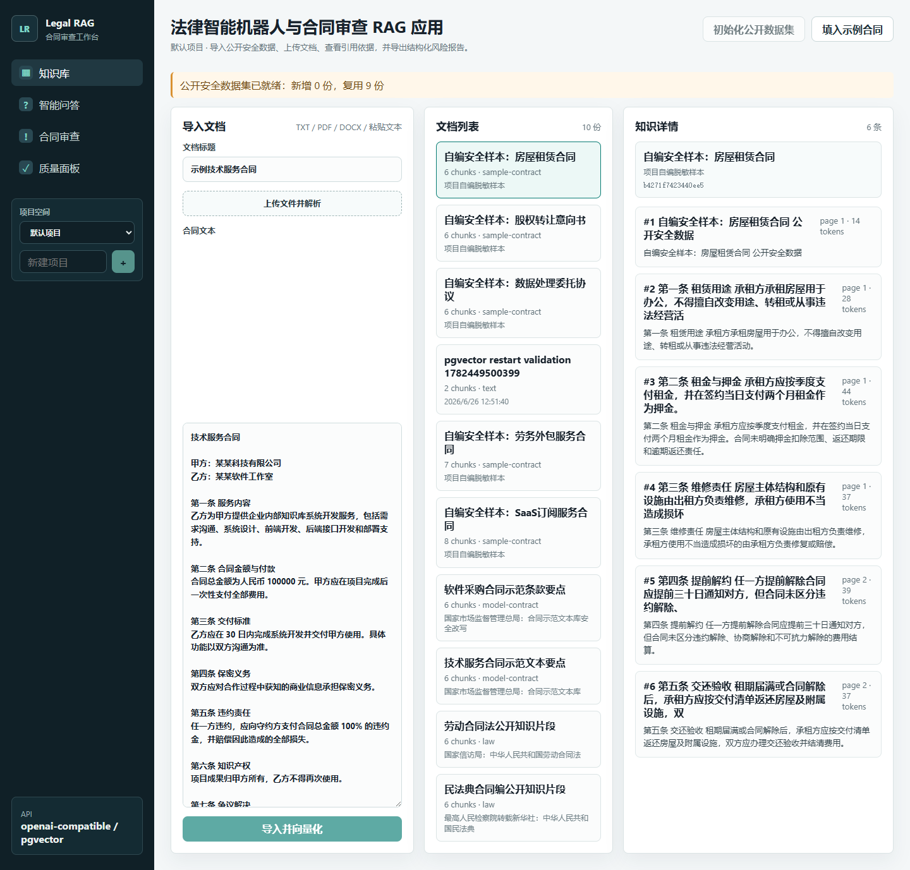
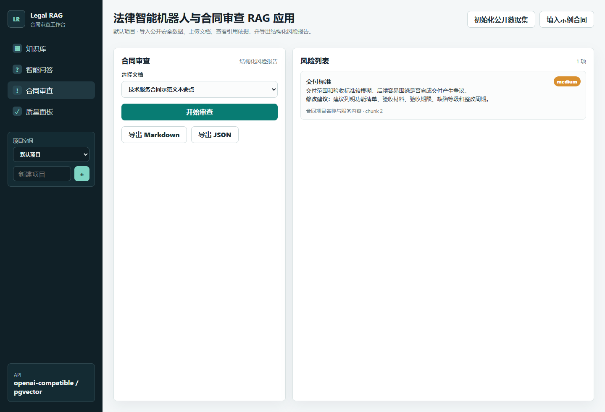
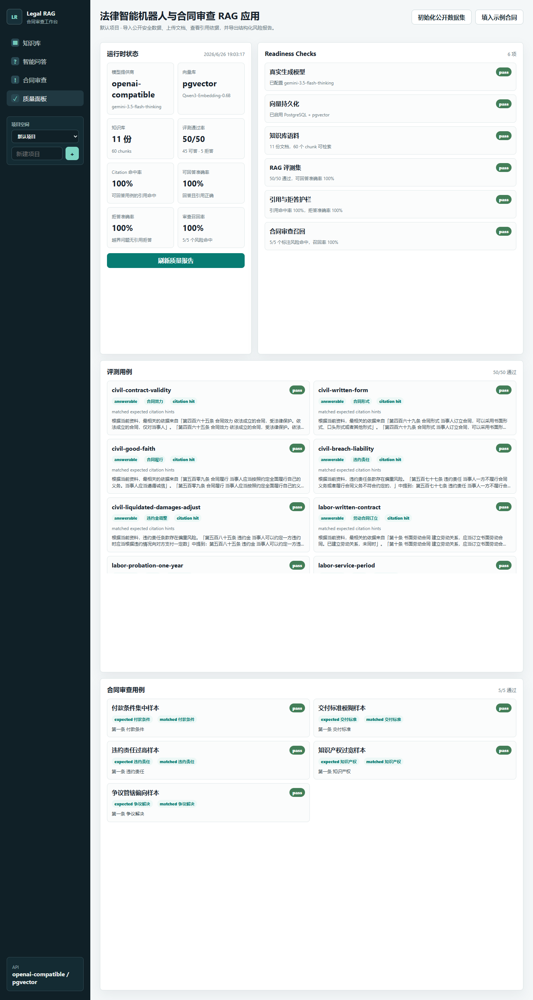
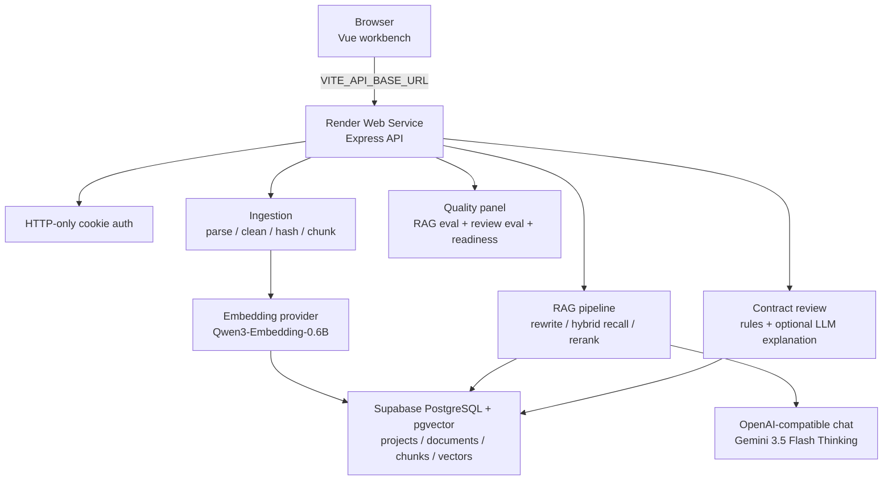

# Legal RAG

法律智能机器人与合同审查 RAG 应用，一个用于简历和面试演示的全栈 RAG 项目。



## 线上 Demo

- Web: `https://legal-rag-web.onrender.com`
- API health: `https://legal-rag-api-9bki.onrender.com/api/health`
- Demo 保护：线上环境启用登录门禁，真实登录账号和密码不提交到仓库。若部署环境显式配置了公开 demo 凭据，登录页会展示“公开演示凭据”和填入按钮；没有展示时代表该入口仍是受控演示。

## 5 分钟演示路径

1. `0:00-0:30` 登录工作台，说明线上 demo 使用登录门禁保护模型 key、上传接口和数据库资源。
2. `0:30-1:20` 进入知识库，初始化公开安全数据集，说明文档会被清洗、判重、chunk，并写入 Supabase pgvector。
3. `1:20-2:30` 切到智能问答，提问“技术服务合同里，验收标准不明确会带来什么风险？”，展示 answer、citations、diagnostics。
4. `2:30-3:40` 切到合同审查，运行示例合同审查，展示风险条款、风险等级、修改建议、引用和导出。
5. `3:40-5:00` 打开质量面板，展示 `openai-compatible / pgvector`、知识库规模、RAG 评测、合同审查评测和 readiness checks。

## 项目亮点截图

| 知识库与入库 | RAG 引用与 diagnostics |
| --- | --- |
|  |  |

| 合同审查 | pgvector health 与评测报告 |
| --- | --- |
|  |  |

## 功能

- 导入合同或法律文本，支持粘贴文本、TXT、PDF、DOCX
- 支持项目空间，同一套应用中隔离不同客户、案件或合同包的知识库
- 可选登录门禁，兼容单用户配置，也支持 `AUTH_USERS_JSON` 多用户演示配置
- 项目级审计日志，记录项目创建、文档导入、数据集初始化、问答和合同审查操作
- 异步入库任务，前端可展示文本导入、文件上传和公开数据集初始化的处理状态
- 一键初始化公开安全法律数据集，保留来源标签和来源 URL
- SHA-256 文档判重，避免重复入库
- 文本清洗和条款级 chunk 切分
- Mock embedding 和内存向量检索
- 查询增强：追问重写、hybrid recall、相似度阈值过滤、轻量 rerank
- RAG 问答，返回 answer + citations
- 合同风险审查，返回结构化 JSON 和 Markdown
- 合同审查采用规则召回 + 可选 LLM 解释 + schema 校验，模型失败时自动回退规则结果
- 合同审查评测集，衡量标注风险召回率
- Vue 前端三页工作台：知识库、智能问答、合同审查、上传进度、问答历史、来源高亮、报告导出
- 问答诊断会展示回答来源：真实模型、本地回退或资料不足拒答
- 质量面板展示运行时模型、pgvector 状态、知识库规模、评测通过率和 readiness checks
- 评测报告页面展示每条 citation 命中和拒答用例的通过原因
- 质量报告展示 citation 命中率、可回答准确率和拒答准确率
- 质量报告展示合同审查风险召回率
- 质量趋势会持久化最近的 RAG/合同审查评测记录，便于观察改动前后指标变化
- RAG 评测集，覆盖 citation 命中和资料不足拒答
- GitHub Actions CI 覆盖 typecheck、unit test、validate、evaluate、evaluate:review、build 和 Docker Compose 配置检查
- 示例合同和面试讲解材料

## 技术栈

- Web：Vue 3 + TypeScript + Vite
- API：Node.js + Express + TypeScript
- Shared：workspace package 共享类型
- Vector store：Memory adapter / PostgreSQL + pgvector
- Model：Mock provider / OpenAI-compatible chat + embedding provider
- Database：PostgreSQL schema 自动迁移，支持项目空间、文档、chunks 和向量持久化

## 架构概览



部署形态：

- 前端和 API 分离部署，前端通过 `VITE_API_BASE_URL` 指向 API。
- API 使用 `WEB_ORIGIN` 精确允许前端来源，并通过 `SameSite=None; Secure` cookie 保持登录态。
- Supabase 托管 PostgreSQL + pgvector；不再额外引入 Aiven。
- Render 免费实例可能冷启动，首次访问 API 会稍慢。

## 启动

```powershell
npm.cmd install
npm.cmd run dev
```

启动后：

- Web: `http://127.0.0.1:5173`
- API: `http://localhost:4000/api/health`

如果只启动单边：

```powershell
npm.cmd run dev:api
npm.cmd run dev:web
```

## 环境变量

复制 `apps/api/.env.example` 后按需修改。

```text
PORT=4000
WEB_ORIGIN=http://localhost:5173
MODEL_PROVIDER=mock
VECTOR_STORE=memory

LLM_BASE_URL=
LLM_API_KEY=
LLM_MODEL=gemini-3.5-flash-thinking
EMBEDDING_BASE_URL=
EMBEDDING_API_KEY=
EMBEDDING_MODEL=Qwen3-Embedding-0.6B
EMBEDDING_DIM=1024

DATABASE_URL=

AUTH_ENABLED=false
AUTH_EMAIL=demo@legal-rag.local
AUTH_NAME=演示用户
AUTH_PASSWORD=
AUTH_USERS_JSON=
AUTH_SESSION_SECRET=
AUTH_SESSION_TTL_HOURS=8
AUTH_COOKIE_SECURE=false
AUTH_COOKIE_SAME_SITE=Lax
```

默认使用 mock provider，不需要真实密钥。

接入真实模型和 Supabase pgvector 时：

```text
MODEL_PROVIDER=openai-compatible
VECTOR_STORE=pgvector
LLM_BASE_URL=https://你的模型网关/v1
LLM_API_KEY=你的模型网关密钥
LLM_MODEL=gemini-3.5-flash-thinking
EMBEDDING_BASE_URL=
EMBEDDING_API_KEY=
EMBEDDING_MODEL=Qwen3-Embedding-0.6B
EMBEDDING_DIM=1024
DATABASE_URL=postgresql://postgres:你的密码@你的host:5432/postgres?sslmode=require
```

`MODEL_PROVIDER=openai-compatible` 时，生成模型走 `LLM_*`，embedding 默认复用同一组 `LLM_*`；如果你给 `EMBEDDING_BASE_URL` 和 `EMBEDDING_API_KEY`，embedding 就会单独走那一组凭据。

如需开启登录门禁：

```text
AUTH_ENABLED=true
AUTH_EMAIL=owner@example.com
AUTH_PASSWORD=请填写强密码
AUTH_SESSION_SECRET=至少16位的随机字符串
AUTH_COOKIE_SECURE=false
AUTH_COOKIE_SAME_SITE=Lax
```

生产 HTTPS 部署时把 `AUTH_COOKIE_SECURE` 改为 `true`。如果前端和 API 是不同站点或不同 Render 子域名，同时设置 `AUTH_COOKIE_SAME_SITE=None`。

如需配置多个演示用户，可以用 `AUTH_USERS_JSON` 替代 `AUTH_EMAIL` / `AUTH_PASSWORD` 登录列表：

```text
AUTH_USERS_JSON=[{"email":"owner@example.com","name":"Owner","password":"强密码1"},{"email":"reviewer@example.com","name":"Reviewer","password":"强密码2"}]
```

默认项目对已登录用户可见，用户新建的项目空间会自动成为该用户的私有项目，后续请求会先校验项目成员权限。

Web 前端支持单独配置线上 API 地址。本地开发可保持为空，继续使用 Vite `/api` proxy；Render Static Site 设置为 API Web Service 地址：

```text
VITE_API_BASE_URL=https://你的-api.onrender.com
```

如果要让访客无需私下询问即可试用受保护工作台，可以在 Web 部署环境显式配置公开 demo 提示：

```text
VITE_PUBLIC_DEMO_EMAIL=demo@legal-rag.local
VITE_PUBLIC_DEMO_PASSWORD=
VITE_PUBLIC_DEMO_NOTE=仅用于公开安全数据集演示，可随时回收。
```

`VITE_PUBLIC_DEMO_PASSWORD` 会被打包进前端页面，所以只能填写低权限、可回收、已确认可公开的 demo 密码，并且要和 API 侧 `AUTH_PASSWORD` 或 `AUTH_USERS_JSON` 中对应 demo 用户的密码保持一致。不要把真实后台管理员密码、模型 key、数据库连接串或 Render/Supabase 运维配置写入这些变量或仓库。

如果当前 token 没有 chat model 权限，系统会继续使用真实 embedding + pgvector 检索，并回退到本地可解释答案模板。

## Docker 部署

仓库提供生产演示用 Docker Compose：一个 PostgreSQL + pgvector、一个 API 容器、一个 Nginx 静态 Web 容器。默认配置使用 mock 模型 + pgvector，因此不需要密钥即可启动并验证持久化链路。

```powershell
Copy-Item .env.docker.example .env
docker compose -f docker-compose.prod.yml up --build
```

如果你的网络访问 npm 官方源更稳定，可以在根目录 `.env` 中把 `NPM_CONFIG_REGISTRY` 改为 `https://registry.npmjs.org`。

启动后访问：

- Web: `http://localhost:8080`
- API health: `http://localhost:8080/api/health`

如需接入真实模型，在仓库根目录 `.env` 中改为：

```text
MODEL_PROVIDER=openai-compatible
VECTOR_STORE=pgvector
LLM_BASE_URL=https://你的模型网关/v1
LLM_API_KEY=你的生成模型密钥
LLM_MODEL=gemini-3.5-flash-thinking
EMBEDDING_BASE_URL=https://你的embedding网关/v1
EMBEDDING_API_KEY=你的embedding模型密钥
EMBEDDING_MODEL=Qwen3-Embedding-0.6B
EMBEDDING_DIM=1024
```

Compose 会自动把 API 的 `DATABASE_URL` 指向内置 Postgres 服务。API 启动时会自动创建 pgvector extension、projects、documents 和 chunks 表。

注意：mock provider 使用 96 维向量，真实 `Qwen3-Embedding-0.6B` 配置使用 1024 维向量。切换 embedding 维度时，请使用新的数据库或重建 Docker volume：

```powershell
docker compose -f docker-compose.prod.yml down -v
```

## Render + Supabase 线上 Demo

如果 PostgreSQL + pgvector 已经在 Supabase 托管，就不需要再额外使用 Aiven。推荐线上演示部署为：

- API：Render Web Service，使用 `apps/api/Dockerfile`
- Web：Render Static Site，设置 `VITE_API_BASE_URL`
- Database：继续使用 Supabase PostgreSQL + pgvector，`DATABASE_URL` 带 `sslmode=require`
- Auth：线上开启 `AUTH_ENABLED=true`，Render 双子域名场景设置 `AUTH_COOKIE_SECURE=true` 和 `AUTH_COOKIE_SAME_SITE=None`

完整步骤见 `docs/deploy-render-supabase.md`。

上线复现清单：

```text
API Render Web Service
- Branch: codex/project-quality-dashboard
- Runtime: Docker
- Dockerfile Path: apps/api/Dockerfile
- Docker Build Context Directory: .
- Health Check Path: /api/health
- DATABASE_URL: Supabase Session Pooler URL + sslmode=require
- WEB_ORIGIN: https://legal-rag-web.onrender.com
- AUTH_ENABLED: true
- AUTH_COOKIE_SECURE: true
- AUTH_COOKIE_SAME_SITE: None

Web Render Static Site
- Branch: codex/project-quality-dashboard
- Build Command: npm ci && npm run build:shared && npm --workspace apps/web run build
- Publish Directory: apps/web/dist
- VITE_API_BASE_URL: https://legal-rag-api-9bki.onrender.com
```

部署后验证：

```powershell
npm.cmd --workspace apps/api run validate:pgvector
```

线上验证：

```text
GET https://legal-rag-api-9bki.onrender.com/api/health
打开 https://legal-rag-web.onrender.com
登录后初始化公开数据集，执行 RAG 问答和合同审查
```

## API

### 健康检查

```http
GET /api/health
```

### 质量报告

```http
GET /api/quality/report
```

返回运行时配置、知识库规模、RAG 评测摘要和 readiness checks，可用于前端质量面板和项目演示。

### 质量趋势

```http
GET /api/quality/trends
```

返回最近的评测记录。线上 pgvector 模式会写入 PostgreSQL `evaluation_runs` 表，本地 memory 模式仅保留当前进程内趋势。

### 评测报告

```http
GET /api/evaluation/report
```

返回评测总数、通过数、拒答用例数和每条用例的通过原因、回答摘要、引用文本，可用于质量面板中的详细评测报告。

### 合同审查评测报告

```http
GET /api/review/evaluation/report
```

返回标注合同风险用例、期望风险、命中风险、缺失风险和整体召回率，用于衡量合同审查规则是否覆盖核心风险类型。

### 项目空间

```http
GET /api/projects
```

```http
POST /api/projects
Content-Type: application/json

{
  "name": "客户 A 合同包",
  "description": "可选说明"
}
```

项目空间用于隔离文档、向量召回、问答和合同审查。没有传 `projectId` 时默认使用 `project_default`。默认项目对已登录用户可见；用户新建项目会记录 owner 和 project member，文档、入库任务、RAG 问答、合同审查和审计日志访问都会校验项目权限。

### 审计日志

```http
GET /api/audit-logs?projectId=project_default
```

返回最近的项目操作记录，包括项目创建、文档导入/上传、公开数据集初始化、RAG 问答和合同审查。审计日志会记录当前登录用户、项目空间、动作、目标和摘要，为后续多用户权限与项目治理打基础。

### 导入文本

```http
POST /api/documents/import-text
Content-Type: application/json

{
  "projectId": "project_default",
  "title": "示例合同",
  "text": "合同正文..."
}
```

前端默认使用异步入库任务接口：

```http
POST /api/ingestion-jobs/import-text
Content-Type: application/json

{
  "projectId": "project_default",
  "title": "示例合同",
  "text": "合同正文..."
}
```

返回 `202 Accepted` 和 job id。随后轮询：

```http
GET /api/ingestion-jobs/:id
```

也可以查看当前项目最近任务：

```http
GET /api/ingestion-jobs?projectId=project_default
```

### 上传文件

```http
POST /api/documents/upload
Content-Type: multipart/form-data

file=<TXT/PDF/DOCX>
projectId=project_default
title=上传文档标题
```

异步上传接口：

```http
POST /api/ingestion-jobs/upload
Content-Type: multipart/form-data

file=<TXT/PDF/DOCX>
projectId=project_default
title=上传文档标题
```

### 初始化公开安全数据集

```http
POST /api/datasets/seed

{
  "projectId": "project_default"
}
```

异步初始化接口：

```http
POST /api/ingestion-jobs/seed

{
  "projectId": "project_default"
}
```

### 文档列表

```http
GET /api/documents?projectId=project_default
```

### 文档 chunks

```http
GET /api/documents/:id/chunks?projectId=project_default
```

### RAG 问答

```http
POST /api/rag/query
Content-Type: application/json

{
  "projectId": "project_default",
  "question": "违约责任是否合理？",
  "topK": 5
}
```

### 合同审查

```http
POST /api/contracts/review
Content-Type: application/json

{
  "projectId": "project_default",
  "documentId": "doc_xxx"
}
```

也可以传入：

```json
{
  "projectId": "project_default",
  "text": "合同正文..."
}
```

## RAG 流程

1. 选择或创建项目空间。
2. 导入文本。
3. 在当前项目内计算 SHA-256 content hash，重复文档直接返回已有记录。
4. 清洗换行和空白。
5. 按条款和段落切分 chunk，保留 projectId、source、page、section、chunkIndex。
6. 生成 embedding。
7. 写入 memory vector store 或 PostgreSQL + pgvector。
8. 提问时先进行轻量问题重写，处理“它/这个/上述”等追问。
9. 在当前项目内同时执行向量召回和关键词召回，合并 top 20 候选。
10. 按相似度阈值和关键词命中过滤低相关片段。
11. 用轻量 rerank 把命中问题关键词、法律术语和条款号的 chunk 排到前面。
12. 对领域外或资料不足的问题返回拒答。
13. 基于检索结果生成回答。
14. 返回 citations 和 diagnostics，支持引用溯源、候选统计和回答来源调试。

## 借鉴的 RAG 工程实践

`resources/` 里保存了一篇 Java + LangChain4j 的 RAG 全流程教程。当前项目没有迁移 Java 技术栈，但借鉴了其中更通用的工程思路：

- 入库阶段增加文件 hash 判重。
- 查询阶段增加问题重写。
- 检索后增加相似度阈值过滤。
- 在向量召回后增加轻量 rerank。
- 保持向量库 adapter 边界，后续可替换 pgvector、Chroma 或 Milvus。
- 增加可运行评测脚本，检查 citation 命中和拒答行为。

## 合同审查流程

合同审查使用可解释规则作为风险召回层：

- 付款节点不合理
- 交付标准模糊
- 违约责任过重
- 知识产权条款过于绝对
- 争议解决地点偏向一方

返回字段包括 clause、riskLevel、issue、suggestion、citation、requiresHumanReview 和 analysisSource。

当配置了真实 chat model 时，系统会把已召回风险和合同片段发给模型，让模型只改写 `issue` 和 `suggestion`。模型必须返回符合 schema 的 JSON，且不能新增未召回风险。校验通过时结果标记为 `model-assisted`；模型不可用或输出不合法时自动回退到 `rules`，保持审查结果可解释、可评测。

## 示例数据

示例合同在 `samples/sample-contract.txt`。前端也提供“填入示例合同”按钮。

公开安全数据集在 `datasets/public-safe/legal-public-dataset.jsonl`，包含公开法律片段、合同示范文本安全摘要和自编脱敏样本，覆盖技术服务、软件采购、SaaS、劳务外包、数据处理、股权转让意向和房屋租赁等场景。可在前端点击“初始化公开数据集”，也可调用 `POST /api/datasets/seed`。

## 验证与评测

```powershell
npm.cmd run typecheck
npm.cmd --workspace apps/api run validate
npm.cmd --workspace apps/api run evaluate
npm.cmd --workspace apps/api run evaluate:review
npm.cmd --workspace apps/api run db:migrate
npm.cmd --workspace apps/api run validate:pgvector
npm.cmd run build
```

`validate` 覆盖健康检查、文本导入、重复导入、数据集初始化、TXT 上传、问答、合同审查和评测报告。`evaluate` 会读取 `eval/rag-eval-set.json`，检查可回答问题的引用命中，以及越界问题是否拒答。`evaluate:review` 会读取 `eval/contract-review-eval-set.json`，检查合同审查规则对标注风险的召回。质量面板会展示总通过率、citation 命中率、可回答准确率、拒答准确率和合同审查风险召回率。
`validate:pgvector` 会使用 `.env` 中的外部 PostgreSQL 和真实 embedding 模型，验证数据集入库、pgvector 检索和引用返回。

CI 工作流位于 `.github/workflows/ci.yml`，无密钥环境会运行：

```powershell
npm.cmd run typecheck
npm.cmd --workspace apps/api run test:unit
npm.cmd --workspace apps/api run validate
npm.cmd --workspace apps/api run evaluate
npm.cmd --workspace apps/api run evaluate:review
npm.cmd run build
docker compose -f docker-compose.prod.yml config
```

## 架构说明

中文总览见 `docs/project-guide.zh-CN.md`。架构说明见 `docs/architecture.md`。领域词汇见 `CONTEXT.md`，关键架构决策见 `docs/adr/`。

## 演示脚本

面试讲解材料见 `docs/interview-notes.md`，线上演示脚本见 `docs/demo-script.md`，中英文简历描述见 `docs/resume-snippets.md`。

## 面试亮点

- 完整 RAG 闭环：导入、chunk、embedding、检索、回答、引用。
- 低幻觉设计：只基于 retrieved chunks 回答，关键结论返回 citations。
- 查询质量增强：问题重写、hybrid search、阈值过滤和 rerank。
- 工程抽象清晰：embedding provider、vector store、review service 可替换。
- 可量化质量：RAG citation/refusal 评测 + 合同审查风险召回评测。
- 无 key 可演示：mock embedding 保证本地可运行。
- 可扩展方向明确：pgvector、BullMQ、真实模型、模型 rerank。

## 后续优化

- 将当前配置型多用户升级为数据库用户表、邀请流程和更完整的角色权限。
- 扩充真实合同数据集与脱敏样本治理流程。
- 增加评测趋势、召回率、拒答准确率和审查召回率报表。
- 增加 CI、镜像发布和云部署脚本。
- 支持 OCR 和更复杂版式解析。
- 引入专门 rerank 模型。
