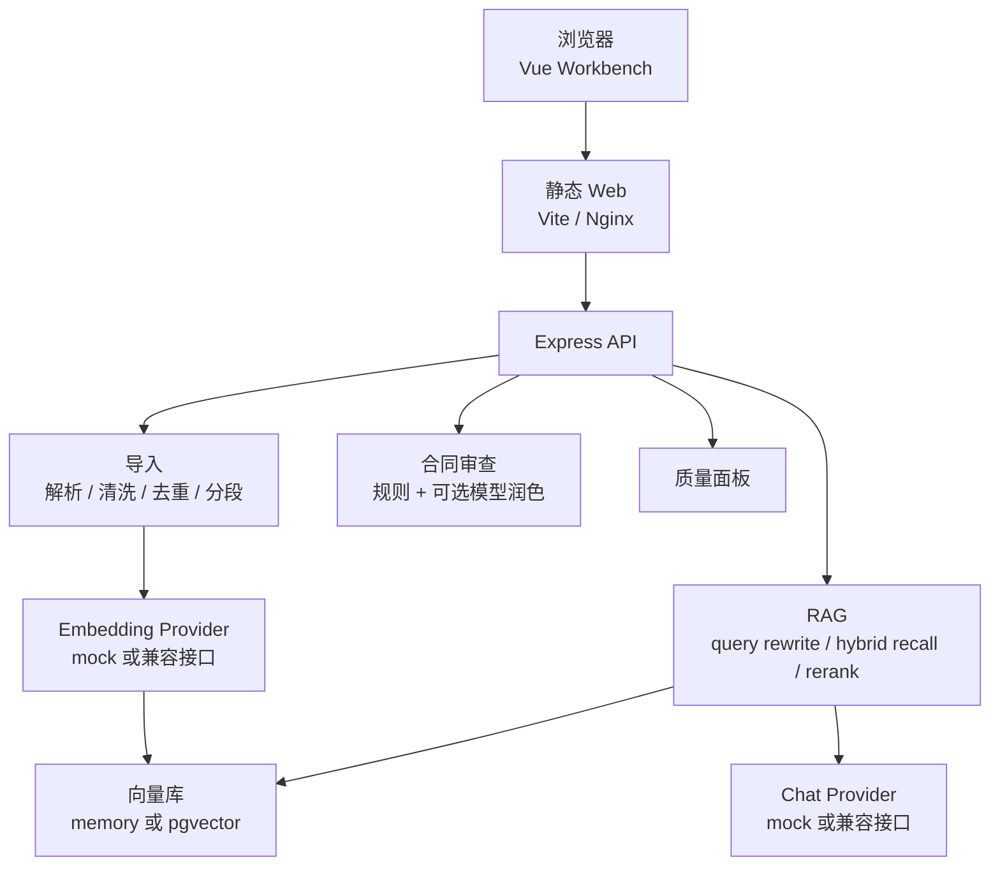

# Legal RAG

中文文档 | [English README](README.md)

Legal RAG 是一个法律文档问答与合同风险审查工作台，覆盖文档导入、公开安全数据集初始化、chunk/embedding、混合检索、引用溯源问答、合同审查和质量评测面板。它既可以在无密钥的 mock 模式下本地运行，也可以接入 PostgreSQL + pgvector 与 OpenAI-compatible 模型服务。

## 功能

- Vue 3 + Vite 前端工作台。
- Express 5 + TypeScript API。
- 文档导入、去重、分段、embedding 和向量检索。
- RAG 问答支持引用、检索 diagnostics 和证据不足拒答。
- 合同审查支持付款、验收、责任、知识产权、管辖等风险项。
- 本地 mock 模式不需要模型 key 或数据库。
- 生产模式支持 OpenAI-compatible chat/embedding provider 和 PostgreSQL + pgvector。
- 质量面板展示 RAG eval、合同审查 eval、pgvector readiness 和运行趋势。
- Docker Compose 可启动 API、Web 和 pgvector PostgreSQL。

## 架构



## 快速开始

要求：

- Node.js 24
- npm

```bash
npm install
npm run dev
```

默认地址：

- Web: `http://127.0.0.1:5173`
- API health: `http://127.0.0.1:4000/api/health`

默认本地模式使用：

```text
MODEL_PROVIDER=mock
VECTOR_STORE=memory
```

因此无需数据库或模型 key。

## 配置

复制示例环境文件：

```bash
cp apps/api/.env.example apps/api/.env
cp apps/web/.env.example apps/web/.env
```

关键 API 变量：

- `MODEL_PROVIDER`: `mock` 或 `openai-compatible`
- `VECTOR_STORE`: `memory` 或 `pgvector`
- `LLM_BASE_URL` / `LLM_API_KEY` / `LLM_MODEL`
- `EMBEDDING_BASE_URL` / `EMBEDDING_API_KEY` / `EMBEDDING_MODEL` / `EMBEDDING_DIM`
- `DATABASE_URL`
- `AUTH_ENABLED`
- `AUTH_USERS_JSON`
- `AUTH_SESSION_SECRET`

`VITE_*` 变量会进入浏览器 bundle。不要把真实管理员密码、模型 key、数据库 URL 或私有服务地址写进 `VITE_*`。

## Docker Compose

```bash
cp .env.docker.example .env
docker compose -f docker-compose.prod.yml up --build
```

默认 Compose 路径使用 mock 模型和 pgvector 数据库。如果切换真实 embedding 维度，建议使用新数据库或重置 Compose volume。

## 测试

```bash
npm run typecheck
npm --workspace apps/api run test:unit
npm --workspace apps/api run validate
npm --workspace apps/api run evaluate
npm --workspace apps/api run evaluate:review
npm run build
docker compose -f docker-compose.prod.yml config
```

可选 pgvector/live embedding 检查：

```bash
npm --workspace apps/api run validate:pgvector
```

该命令需要安全的 PostgreSQL 与 embedding 配置。

## 安全边界

- 不提交 `.env`、模型 key、数据库 URL、Cookie、密码或 provider endpoint。
- 公开 demo 账号必须低权限、可撤销，并且明确允许公开。
- 合同审查是工程演示，不构成法律意见。
- RAG 回答需要引用支撑，最终法律判断仍需人工审核。

## 许可证

当前仓库还没有独立许可证文件。正式作为可复用开源项目推广前，需要选择并添加许可证。
