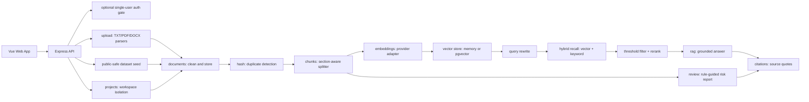

# Architecture

Legal RAG is a small monorepo that demonstrates a complete legal-document RAG loop without requiring a live model key.

## Runtime

- `apps/web`: Vue 3 + TypeScript + Vite UI.
- `apps/api`: Express + TypeScript API.
- `packages/shared`: shared request and response types.
- `samples/sample-contract.txt`: demo contract used for local validation.
- `datasets/public-safe/legal-public-dataset.jsonl`: public-safe legal snippets and synthetic contract samples.
- `eval/rag-eval-set.json`: citation and refusal evaluation cases.
- `VECTOR_STORE=pgvector`: persists documents, chunks, metadata, and embeddings in PostgreSQL + pgvector.
- `projects`: workspace boundary for documents, duplicate detection, retrieval, and contract review. `project_default` keeps local demo behavior backward-compatible.
- `AUTH_ENABLED=true`: optional single-user login gate for deployed demos. It protects business APIs with a signed HTTP-only cookie while leaving local demos disabled by default.
- `.github/workflows/ci.yml`: no-secret CI path for typecheck, unit tests, validation, evaluation, build, and Docker Compose config checks.

## RAG Flow

1. The user selects or creates a project space through `GET /api/projects` and `POST /api/projects`.
2. Within that project, the user imports text through `POST /api/documents/import-text`, uploads TXT/PDF/DOCX through `POST /api/documents/upload`, or seeds the public-safe dataset through `POST /api/datasets/seed`.
3. The API computes a SHA-256 content hash scoped to the project and returns the existing document when the same text is imported again.
4. The API cleans text, enriches source metadata with `projectId`, splits it into section-aware chunks, and estimates token count.
5. `MockEmbeddingProvider` creates deterministic local embeddings when no API key is available; `OpenAICompatibleEmbeddingProvider` can call a real embedding model such as `Qwen3-Embedding-0.6B`.
6. `MemoryVectorStore` stores chunks and vectors in process memory; `PgVectorStore` persists chunk embeddings in PostgreSQL + pgvector.
7. `POST /api/rag/query` rewrites short contextual questions, embeds the rewritten question, recalls top 20 candidates from both vector and keyword search inside the selected project, filters weak candidates, reranks down to top 5, generates a grounded answer, and returns citations plus diagnostics.
8. `GET /api/quality/report` aggregates runtime configuration, corpus size, the deterministic RAG eval suite, and readiness checks for the web quality panel.
9. `GET /api/evaluation/report` exposes every deterministic eval result so the web UI can show citation-hit, expected topic, refusal evidence, and aggregate accuracy metrics, not just a summary score.
10. When the query is outside the current legal/contract corpus or retrieval evidence is too weak, the RAG service refuses with a "current materials cannot confirm" answer and no citations.

## Contract Review Flow

The MVP review service uses deterministic legal-risk rules. This keeps the demo stable and auditable:

- Payment terms: detects single final payment or unclear payment milestones.
- Delivery: detects vague acceptance standards.
- Breach liability: detects high liquidated damages and uncapped losses.
- IP: detects overly broad ownership and reuse restrictions.
- Dispute resolution: detects one-sided venue clauses.

The service returns both structured JSON and readable Markdown.

## Extension Points

- Switch between mock/memory and OpenAI-compatible/pgvector with environment variables.
- Move document processing to BullMQ when ingestion becomes asynchronous.
- Replace the current lightweight rerank with a cross-encoder or model reranker.
- Add OCR and table-aware parsing for scanned or complex contracts.
- Add risk-review recall evaluation against labeled contract-risk fixtures.
