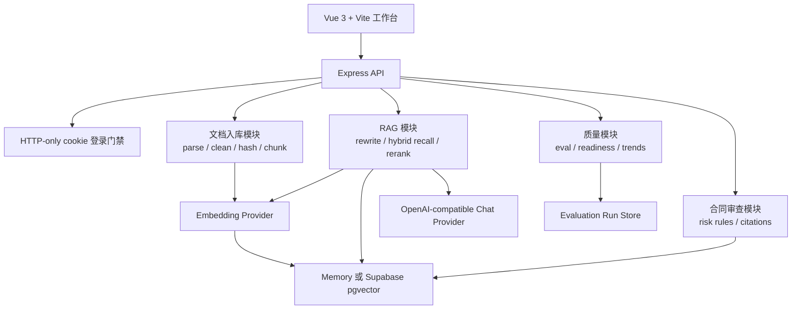

# Legal RAG 中文项目指南

这份文档用于快速理解 Legal RAG 的项目定位、当前能力、演示方式和后续完善路线。它适合放在作品集、面试准备、项目交接和后续开发规划里使用。

## 项目定位

Legal RAG 是一个法律文档问答与合同风险审查应用。项目目标不是只做一个聊天窗口，而是展示一个完整的 AI 应用工程闭环：

1. 文档导入、解析、清洗和判重。
2. 条款级 chunk 切分和元数据保存。
3. embedding 生成和 pgvector 持久化。
4. 向量召回、关键词召回、阈值过滤和轻量 rerank。
5. 基于检索证据生成回答，并返回 citation。
6. 对资料不足或越界问题进行拒答。
7. 对合同条款输出结构化风险、修改建议和人工复核标记。
8. 用评测集、质量面板和趋势记录证明效果没有退化。

本地默认使用 mock provider 和 memory vector store，保证无模型 key、无数据库也能跑通核心流程。线上 demo 使用 Render、Supabase PostgreSQL + pgvector、OpenAI-compatible 生成模型和 Qwen3-Embedding-0.6B embedding。

## 当前已经完成的能力

### 作品集包装

- README 已包含线上 demo、项目截图、5 分钟演示路径、功能清单、技术栈、架构图、API 示例和部署说明。
- `docs/demo-script.md` 提供线上演示脚本和故障处理建议。
- `docs/interview-notes.md` 提供 1 分钟、3 分钟介绍和高频追问回答。
- `docs/resume-snippets.md` 提供中文和英文简历项目描述。
- `docs/assets/screenshots/` 保存知识库、RAG 引用、合同审查和质量面板截图。

### 产品体验

- 前端已经拆分为登录、侧边栏、顶部栏、知识库、智能问答、合同审查和质量面板等 Vue 模块。
- 登录、模型失败、数据库失败和 Render 冷启动有更友好的前端提示。
- 移动端布局已优化，适合手机查看演示。
- `apps/web/scripts/e2e-smoke.mjs` 可做前端 smoke test，覆盖线上登录和 health 检查。

### 工程深度

- 后端保留 provider adapter 和 vector store adapter，同一套业务逻辑可在 mock/memory 和 openai-compatible/pgvector 之间切换。
- `apps/api/src/runtime.ts` 负责 runtime 装配，避免 `app.ts` 同时承担全部职责。
- `CONTEXT.md` 记录领域词汇，`docs/adr/` 记录 Render、Supabase、provider/vector store、单用户 auth 和质量趋势持久化等决策。
- CI 覆盖 typecheck、unit test、validate、RAG eval、contract review eval、build 和 Docker Compose 配置检查。
- 质量趋势已经设计为 `Evaluation Run`，本地 memory 模式记录进程内趋势，pgvector 模式写入 PostgreSQL `evaluation_runs` 表。

## 线上演示路径

推荐用 5 分钟讲清楚完整价值：

1. 登录工作台，说明线上 demo 使用单用户门禁保护模型 key、上传接口和数据库资源。
2. 进入知识库，初始化公开安全数据集，说明文档会被清洗、判重、chunk，并写入 Supabase pgvector。
3. 切到智能问答，提问：

```text
技术服务合同里，验收标准不明确会带来什么风险？
```

4. 展示回答、citations 和 diagnostics，强调回答基于 retrieved chunks，而不是裸模型直接生成。
5. 切到合同审查，运行示例合同审查，展示风险条款、风险等级、修改建议、引用和导出。
6. 打开质量面板，展示模型、向量库、知识库规模、RAG 评测、合同审查评测和质量趋势。

## 架构概览



关键设计是把可替换能力放在 adapter 后面：

- `EmbeddingProvider`: mock embedding 或真实 embedding。
- `ChatProvider`: 本地 fallback 或 OpenAI-compatible 生成模型。
- `VectorStore`: memory vector store 或 PostgreSQL + pgvector。
- `EvaluationHistoryStore`: memory trend store 或 PostgreSQL trend store。

## 质量保障

项目不是只靠手动演示证明效果，而是保留了几层可验证机制：

- `npm.cmd --workspace apps/api run validate`: 跑完整 API 验证链路。
- `npm.cmd --workspace apps/api run evaluate`: 检查 RAG citation 命中和资料不足拒答。
- `npm.cmd --workspace apps/api run evaluate:review`: 检查合同审查对标注风险的召回。
- `npm.cmd --workspace apps/api run validate:pgvector`: 用真实 Supabase 和真实 embedding 验证 pgvector 链路。
- `npm.cmd --workspace apps/web run test:e2e:smoke`: 检查线上前端登录和 API health。

质量面板展示当前 runtime、知识库规模、RAG 评测、合同审查评测、readiness checks 和历史趋势。这样面试或复盘时可以说明：项目不仅能跑，还能量化回答质量和风险审查覆盖率。

## 部署现状

当前推荐部署形态：

- Web: Render Static Site。
- API: Render Docker Web Service。
- Database: Supabase PostgreSQL + pgvector。
- Auth: 线上启用单用户登录，使用 HTTP-only signed cookie。

Supabase 已经承担 PostgreSQL + pgvector 职责，不需要再额外接入 Aiven。Render 免费实例可能冷启动，因此前端会提示 API 正在唤醒。

## 后续完善路线

### 第一阶段：收尾质量趋势

质量趋势持久化已经接近完成，应先完成验证、提交和部署。完成后，质量面板就可以展示最近的 RAG 和合同审查评测变化。

### 第二阶段：多用户和项目空间权限

当前 `Project Space` 已经用于隔离文档、问答和审查，但登录仍是单用户门禁。下一步可以增加：

- 用户表和项目成员关系。
- 项目级角色权限。
- 每个请求解析当前用户和授权项目空间。
- 审计日志，记录导入、上传、问答和审查操作。

这会让项目从 demo 更接近真实 SaaS 产品。

### 第三阶段：异步入库任务

当前入库流程在请求中同步完成。对于大文件、PDF、真实 embedding 和批量合同，建议引入 `Ingestion Job`：

- 上传后立即返回 job id。
- 后台执行解析、chunk、embedding 和 pgvector upsert。
- 前端轮询进度、失败原因和重试状态。
- 本地可先用 inline worker，后续再替换为 BullMQ 或其他队列。

### 第四阶段：LLM 辅助合同审查

当前合同审查使用确定性规则，稳定且可评测。下一步可以保留规则作为召回层，再加入模型解释：

- 规则先召回可疑条款。
- LLM 对候选条款生成风险解释和修改建议。
- 用 schema 校验输出字段。
- 保留 citation 和 `requiresHumanReview`，避免把模型输出当成最终法律意见。

### 第五阶段：评测发布门禁

现在 CI 会运行评测，但还可以进一步做：

- 评测基线文件。
- 指标阈值，例如 citation accuracy、refusal accuracy、review recall。
- CI 生成 JSON/HTML 评测报告。
- 质量趋势和每次 commit 或 release 关联。

这会让项目更像一个真正长期维护的 AI 工程项目。

## 面试表达重点

可以把项目浓缩成一句话：

```text
这是一个已经部署的法律文档 RAG 与合同审查项目，完整覆盖文档入库、pgvector 持久化、混合召回、引用溯源、资料不足拒答、合同风险审查和质量评测，既能本地无 key 运行，也能在线上接入真实模型和 Supabase pgvector。
```

如果面试官追问工程亮点，优先讲这三点：

1. `provider/vector store adapter` 让本地演示和线上真实链路复用同一套业务逻辑。
2. `citations + refusal + eval` 是法律场景降低幻觉的核心设计。
3. `Quality Report + Evaluation Run` 让项目从“能回答”升级为“能持续证明质量”。
